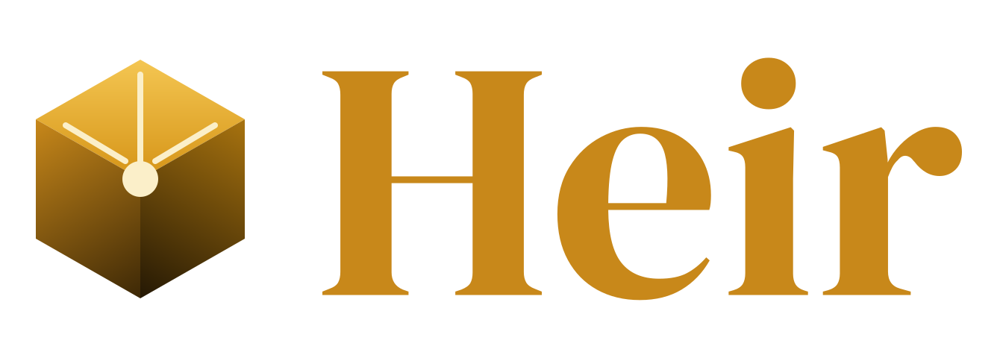

# heir

**heir** is an open-source Kubernetes distribution that simplifies cluster operations at scale. Instead of spreading control plane components across 
dedicated nodes, heir consolidates the entire control plane into a single stateless pod running inside a management Kubernetes cluster, leaving worker 
nodes free to run only workloads.

> *"Nothing is good enough to be considered final, everything is just a bridge to what comes next."*
> — [Why heir?](https://tardigradeproj.github.io/docs/blog/why-heir)

## Architecture

See the **[Architecture documentation](https://tardigradeproj.github.io/docs/architecture)** for a full breakdown of the control plane design, data plane model, network model, and multi-tenancy approach.

## Why heir?

- **No HA tax** - run highly available clusters without traditional 3-node control plane minimums.
- **Fleet scale** - one management cluster can govern hundreds of data planes simultaneously.
- **Single artifact** - distributed as a self-contained binary and container image.
- **Less noise on workers** - operators and remote-capable add-ons run on the management cluster.
- **Operational simplicity** - automatic certificate renewal and cluster upgrades, no deep Kubernetes expertise required.

Read the full story: **[Why heir?](https://tardigradeproj.github.io/docs/blog/why-heir)**

## Getting started

See the **[documentation](https://tardigradeproj.github.io/docs/)** for installation, configuration, and usage guides.

## Development

See [CONTRIBUTING.md](CONTRIBUTING.md) for guidelines on submitting issues, pull requests, and commit conventions.
